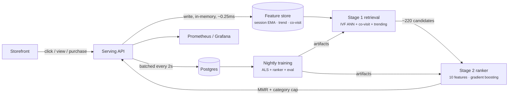

<div align="center">

# StreamRank

**Real-time recommendation system: two-stage retrieval, learned ranking, streaming features.**

A click changes the next response in milliseconds — and the numbers that prove it are measured,
not asserted.


</div>

---

## What this is

A complete recommender, not a notebook: candidate generation, learned ranking, an online feature
store, an A/B experiment with a significance test, latency budgets per stage, and a storefront
that makes the behaviour visible.

The interesting part is the loop. Click a product and the service writes to a session vector, a
decayed trend counter and a co-visitation graph **synchronously**, then the next request retrieves
different candidates and ranks them differently. The storefront shows the latency of every stage
and the ranking features of the item you just clicked.

## Measured results

| Metric | Value | How it was measured |
| --- | --- | --- |
| End-to-end latency | **p50 0.6 ms · p95 25 ms · p99 52 ms** | 600+ requests through the real API |
| Stage 1 retrieval (p95) | **< 1 ms** | IVF probe over embeddings + co-visitation + trending |
| Stage 2 ranking (p95) | **~13 ms** | gradient-boosted ranker over ~220 candidates |
| Online feature write | **~0.25 ms** | click path, before the next request is served |
| NDCG@10 | **0.456** vs 0.384 popularity, 0.236 embeddings-only | chronological hold-out, 530 users |
| Recall@10 | **0.568** vs 0.436 popularity | same hold-out |
| Catalogue coverage@10 | **95.8%** | the lift is not head-item collapse |
| Ranker AUC | **0.887** | 13.5k labelled pairs |
| Online CTR uplift | **+20.7%**, z = **3.58** (95% significant) | simulated shoppers through the real API |
| Smoke suite | **15/15** | `python scripts/smoke.py` |

Dataset: 96 real product photos, 1,500 simulated shoppers, **75,078** interactions with a 27.7%
click-through rate. Everything is regenerated deterministically from a seed.

## Architecture



Full write-up: [`docs/architecture.md`](docs/architecture.md).

### Why two stages

Scoring the whole catalogue with a learned model does not scale; scoring with a cheap model alone
loses accuracy. Retrieval is recall-oriented and sub-linear (IVF cells, probe count as the knob).
Ranking is precision-oriented over a few hundred candidates. The offline table above is the
argument: embeddings alone **lose** to popularity on short sessions, and the learned combination
of both beats either by a wide margin.

## Quickstart

```bash
python -m venv .venv && .venv/bin/pip install -r requirements.txt   # Windows: .venv\Scripts\pip
python ml/generate_data.py            # 96 items, ~75k interactions
python ml/train.py                    # ALS + IVF + ranker + offline eval
uvicorn app.main:app --port 8200      # http://localhost:8200/docs
python scripts/smoke.py               # 15 checks incl. the A/B experiment
```

Storefront:

```bash
cd web && npm install && npm run dev  # http://localhost:3100
```

Product imagery is committed (`data/catalog_images.json`). To refresh it:
`PEXELS_ACCESS_KEY=... python scripts/fetch_images.py`.

### Full stack in Docker

```bash
docker compose up -d --build
```

| Service | URL |
| --- | --- |
| Storefront | <http://localhost:3100> |
| API (OpenAPI) | <http://localhost:8200/docs> |
| Prometheus | <http://localhost:9091> |
| Grafana (admin / streamrank) | <http://localhost:3002> |

The image generates the dataset and trains the model during build, so a deploy always ships a
model whose metrics are recorded next to it.

## API

```bash
# a personalised rail
curl -X POST localhost:8200/v1/recommend -H 'content-type: application/json' \
  -d '{"user_id":"usr_00042","session_id":"ses_demo","limit":12}'

# stream a click back — the next call already reflects it
curl -X POST localhost:8200/v1/events -H 'content-type: application/json' \
  -d '{"user_id":"usr_00042","session_id":"ses_demo","item_id":"itm_0031","event":"click","request_id":"req_..."}'

# experiment report with a two-proportion z-test
curl localhost:8200/v1/experiment

# drive synthetic shoppers through the real path
curl -X POST localhost:8200/v1/simulate -H 'content-type: application/json' -d '{"users":120,"steps":5}'
```

| Endpoint | Purpose |
| --- | --- |
| `POST /v1/recommend` | two-stage rail with per-item reasons and features |
| `POST /v1/events` · `/v1/events/batch` | behavioural events, feature update on the write path |
| `GET /v1/catalog` · `/v1/catalog/{id}` · `/v1/trending` | catalogue and decayed trend ranking |
| `GET /v1/stats` | latency percentiles, index shape, feature store, offline metrics |
| `GET /v1/experiment` | A/B report, uplift, z-score, significance |
| `POST /v1/simulate` | synthetic traffic through the real serving path |
| `POST /v1/reload` | hot-reload retrained artifacts |
| `GET /metrics` | Prometheus exposition |

## Storefront

- **Storefront** — a real product grid. Clicking teaches the model; the panel shows the session
  vector, candidate sources, per-stage latency and the ranking features of the last click.
- **Insights** — latency percentiles per stage, the live A/B experiment with significance, the
  offline evaluation table, index shape and feature-store internals, plus a traffic generator.
- **Architecture** — the serving diagram, latency budget, model card and API surface.

Deployed without a backend, the storefront runs a genuine in-browser version of the recommender:
the committed catalogue ships the first eight latent dimensions per item, so cosine retrieval,
session EMA and MMR all run client-side. Point it at the service with
`NEXT_PUBLIC_USE_MOCKS=false` and `NEXT_PUBLIC_API_URL`.

## Repository layout

```
app/
  config.py db.py models.py schemas.py      configuration and durable state
  recsys.py                                 feature store, IVF retrieval, ranker, MMR
  service.py                                orchestration, experiment, batched persistence
  observability.py main.py                  metrics, logging, FastAPI surface
ml/
  generate_data.py                          catalogue + simulated behaviour log
  train.py                                  implicit ALS, IVF, ranker, chronological eval
web/                                        Next.js storefront + insights console
deploy/k8s/                                 deployment, HPA, PDB, nightly retrain CronJob
observability/                              Prometheus config + Grafana dashboard
scripts/                                    fetch_images.py, smoke.py
docs/architecture.md                        design, trade-offs, evaluation method
```

## Honest notes

- **Behaviour is simulated.** Shoppers have hidden taste vectors and click what they like. Offline
  metrics are valid for that distribution and the online uplift measures the ranker against the
  baseline; neither is a claim about a real marketplace.
- **The index is in-process.** Correct and fast to a few hundred thousand items; past that,
  embeddings belong in a dedicated vector store. `Retriever` is the seam.
- **Session features are per-replica.** For the sharpest personalisation, pin a session to a
  replica or centralise the store in Redis. Trending and co-visitation converge across replicas
  through the durable log.
- **Ranker warmup matters.** The first tree-ensemble prediction costs ~150 ms, so the service
  warms up at startup. Without it, your first request looks ten times slower than your hundredth.

## License

MIT — see [LICENSE](LICENSE).

Built by **Shahriar Ahmed Seam** · Somokolon Labs. Product photography from
[Pexels](https://www.pexels.com); catalogue text, prices and behaviour are synthetic.
