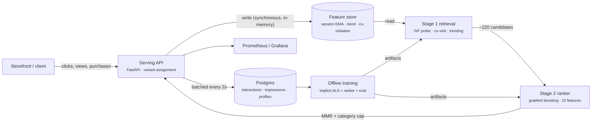

# Architecture

StreamRank is a two-stage recommender served behind one API, with an online feature
store that is written on the click path and read by the very next request.

## Request path

| Step | Work | Budget |
| --- | --- | --- |
| 1 | Variant assignment (hash bucket, sticky per user) | microseconds |
| 2 | Query vector: offline user factor blended with the live session EMA | microseconds |
| 3 | Stage 1: IVF probe over item embeddings + co-visitation + trending | < 1 ms p95 |
| 4 | Stage 2: feature matrix for ~220 candidates, one batched `predict_proba` | ~13 ms p95 |
| 5 | MMR diversification with a per-category cap | < 1 ms |
| 6 | Impression buffered in memory, flushed in batches | off the request path |

Measured end to end: **p50 0.6 ms, p95 25 ms, p99 52 ms** on a laptop with 96 items and
~220 candidates per request. Ranking dominates the budget, which is the expected shape: it is
the only stage whose cost scales with candidate count.

## Stage 1 — retrieval

Three complementary sources, merged and deduplicated:

* **Embeddings (ANN).** Implicit-feedback ALS over the interaction matrix produces 32-dim item
  factors. Items are clustered into IVF cells with k-means; a query scores the centroids, probes
  the closest cells and scores only their members. The probe count trades recall for latency.
* **Co-visitation.** Item-item counts from the same session, decayed by recency. Cheap, and it
  covers new items that embeddings have not learned yet.
* **Trending.** Exponentially decayed click counters with a 15-minute half-life. This is also the
  entire control variant, so the baseline is a real baseline.

## Stage 2 — ranking

Ten features per candidate, identical in training and serving (`ml/train.py` and
`app/recsys.py` compute them the same way, in the same order):

`mf_score`, `session_affinity`, `covisit`, `popularity`, `item_ctr`, `price_z`, `rating`,
`category_affinity`, `brand_affinity`, `is_cold_user`.

A `HistGradientBoostingClassifier` predicts click probability. If artifacts are missing the
service degrades to a linear blend of the same features rather than failing.

## Streaming features

Written synchronously on the event path (~0.25 ms), so the next request already reflects the
click:

* session EMA vector (decay 0.86), capped item history;
* long-lived user vector (slower decay);
* per-item view/click counters and a decayed trend score;
* co-visitation edges between positives in the same session;
* category and brand affinity counters.

A background task flushes interactions and impressions to Postgres every two seconds and
snapshots profiles, item stats and the top co-visitation edges periodically. Losing the
in-memory store costs recommendation quality for a few seconds — never correctness — and it can
be rebuilt from the durable log.

## Offline evaluation

The log is split chronologically: 70% to fit ALS and the aggregates, 15% to train the ranker,
15% held out for evaluation. Candidates for evaluation come from the same retrieval path used in
production, and three strategies are ranked on the same candidate sets:

| Strategy | NDCG@10 | Recall@10 |
| --- | --- | --- |
| popularity baseline | 0.384 | 0.436 |
| embeddings only | 0.236 | 0.319 |
| **two-stage (retrieval + ranker)** | **0.456** | **0.568** |

Catalogue coverage at 10 is 95.8%, so the lift is not achieved by collapsing onto a handful of
head items. Embeddings alone losing to popularity on short sessions is the reason both signals
are combined in a learned ranker instead of picking one.

## Experiment framework

Users are bucketed by `sha256(experiment:user_id)`, so assignment is sticky, uniform and
independent of traffic order. Impressions are the denominator, first click per impression is the
numerator, and the report includes a two-proportion z-test. `POST /v1/simulate` drives synthetic
shoppers with known hidden preferences through the real API so the comparison is measurable:
the recorded run shows **+20.7% CTR** for the two-stage variant at **z = 3.58**.

## Deployment

* One image: dataset generation and training run at build time, so the container ships a model
  whose metrics are recorded alongside it.
* Kubernetes: 3+ replicas, HPA on CPU, PDB, topology spread, nightly retraining CronJob.
* Postgres holds the durable log; Redis is optional and used for cross-replica caching.
* The storefront is a separate Next.js image, or a static demo on Vercel using the in-browser
  model.

## Trade-offs

* **In-process index.** Fast and simple up to a few hundred thousand items. Beyond that the
  embeddings belong in a dedicated vector store, and the code isolates that behind `Retriever`.
* **Per-replica online features.** Session state is local, so a user's session should stick to a
  replica (or be centralised in Redis) for the sharpest personalisation. Trending and
  co-visitation converge across replicas through the durable log.
* **Simulated traffic.** The behaviour model is synthetic. Offline metrics are honest for the
  simulated distribution; the online CTR uplift measures the ranker against the baseline, not
  real market performance.
